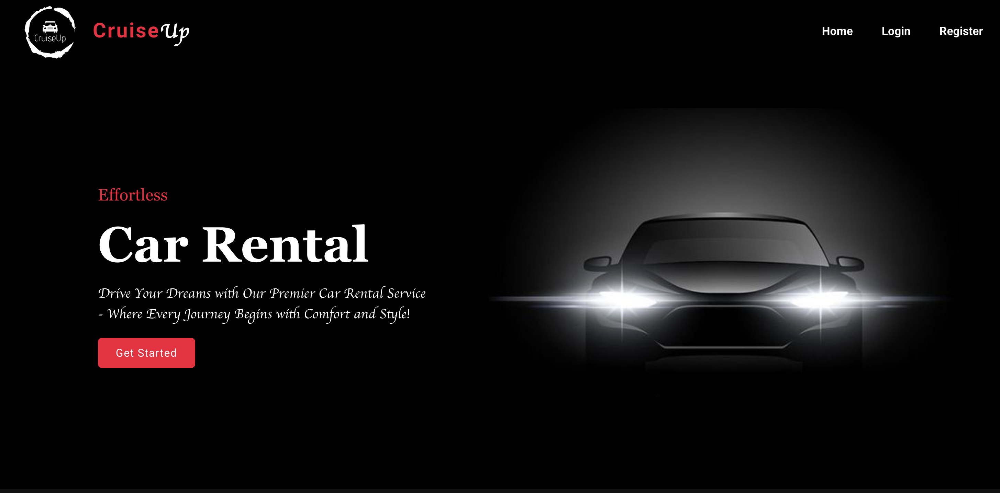

# CruiseUp : A Full-Stack Vehicle Rental Platform

CruiseUp is a comprehensive, full-stack web application designed to provide a seamless and efficient car booking experience. Built with the MERN-stack principles, it allows users to browse a wide variety of available vehicles, view detailed information, and book them for specific dates.

This project is divided into two main repositories: a React.js frontend for a dynamic user interface and a Node.js/Express.js backend powering the API and business logic, connected to a robust MySQL database.

---

##  Live Demo

<p align="center">
  <a href="https://cruiseup.netlify.app/" target="_blank">
    
  </a>
</p>

---

##  Preview

<p align="center">
  
</p>

---

## Key Features

* Secure User Authentication: A complete registration and login system using JSON Web Tokens (JWT) for secure session management. Passwords are encrypted using bcrypt.
* Dynamic Car Catalog: Browse a comprehensive list of available cars fetched from the backend. Users can view high-level details on the main page and click for more information.
* Detailed Vehicle Information: Each car has a dedicated page showing detailed specifications, rental price per day, and current availability status.
* Interactive Booking System: An intuitive booking form that allows authenticated users to select rental start and end dates.
* User-Specific Dashboard: Logged-in users can view a personalized list of their current and past bookings.
* RESTful API: A well-structured backend API built with Node.js and Express.js to handle all business logic, including user management, car listings, and rental processing.
* Relational Database: All data is persisted in a MySQL database with a clear and structured schema for users, cars, and rentals.

---

##  Architectural Overview

### Client-Side Logic (React.js)

* React Router for client-side navigation.
* React Context API (AuthContext) for global authentication state.
* Axios for backend communication.

### Backend Logic (Node.js & Express.js)

* RESTful endpoints for authentication (`/api/auth`), car data (`/api/cars`), and rentals (`/api/rentals`).
* Controllers handle validation, availability checks, and rental creation.
* MySQL for data persistence.
* JWT for secure authentication and bcrypt for password encryption.

---

##  Tech Stack

**Frontend**

* React.js
* React Router DOM
* React Context API
* Axios
* CSS / Tailwind / Material-UI (depending on styling choice)

**Backend**

* Node.js, Express.js
* MySQL
* JWT, bcrypt
* Middleware: CORS, Cookie-Parser

---

##  Folder Structure

### Backend Structure

```
Project-02-Car_Rental_Backend-main/
├── controllers/
│   ├── auth.js
│   ├── car.js
│   └── rental.js
├── routes/
│   ├── auth.js
│   ├── cars.js
│   └── rentals.js
├── db.js
├── server.js
└── package.json
```

### Frontend Structure

```
Project-02-Car_Rental_Frontend-main/
└── src/
    ├── components/
    ├── context/
    │   └── AuthContext.js
    ├── pages/
    ├── App.js
    ├── index.js
    └── package.json
```

---

##  Local Development Setup

### Prerequisites

* Node.js (v14 or later)
* npm or yarn
* MySQL server

### Backend Setup

```bash
cd Project-02-Car_Rental_Backend-main
npm install
```

* Create a new MySQL database.
* Import `car_rental_database.sql`.
* Update DB credentials in `db.js`.

```bash
npm start
```

Runs at: [http://localhost:8800](http://localhost:8800)

### Frontend Setup

```bash
cd Project-02-Car_Rental_Frontend-main
npm install
npm start
```

Runs at: [http://localhost:3000](http://localhost:3000)
